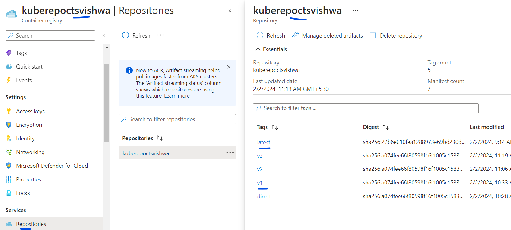
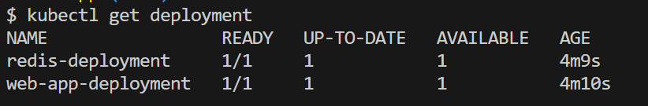
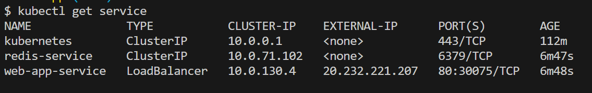
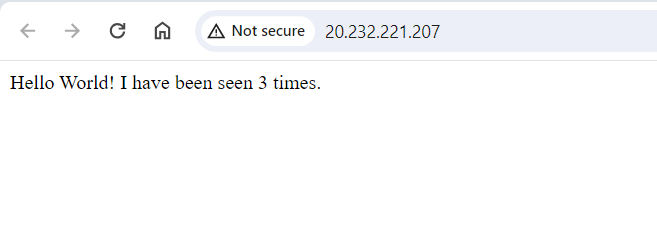
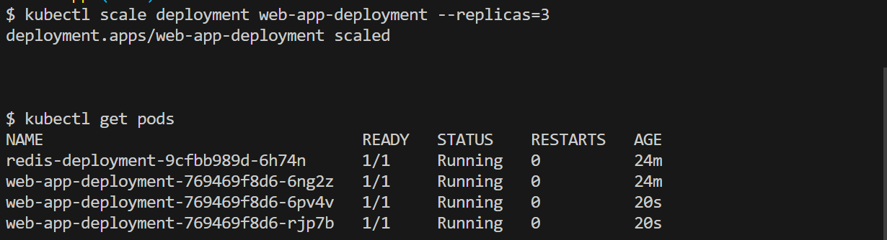

# Simple Application deployment on the AKS.

## Assumptions

   * Deployment name : web-app-deployment
   * Service Name : web-app-service

## Pre-Requisite 
 * Upload the Docker image to the ACR.

   1. Az commands to create the ACR. 
   ```
   az group create --name rg-kube --location "East US"
   az acr create --resource-group rg-kube --name kuberepoctsvishwa --sku Basic
   ```
   

   2. Download the repo to the local and build the image locally first for app.
   
   ```
   docker build . -t kuberepoctsvishwa.azurecr.io/kuberepoctsvishwa:v1
   ```

   3. Login to the repo and push the image.
   
   ```
   docker login kuberepoctsvishwa.azurecr.io -u kuberepoctsvishwa 
   ```
   after this pass the password.

   4. Let push the image to the repo
   ```
   docker push kuberepoctsvishwa.azurecr.io/kuberepoctsvishwa:v1
   ```
   


 * Kubernetes cluster on Azure
   1. create the cluster 
   ```
   az aks create -g rg-kube -n myAKSCluster --enable-managed-identity --node-count 1 --enable-addons monitoring --enable-msi-auth-for-monitoring  --attach-acr kuberepoctsvishwa --generate-ssh-keys
   ```

   2. Add the Kubernetes Clsuter credentials to the local system
   ```
   az aks get-credentials --resource-group rg-kube --name myAKSCluster
   ```
   Note: -- Assuming Resource Group "rg-rube" is already created.

   3. Check if the kubectl is working
   ```
   kubectl get pods -A
   ```
   This would list all the pods including the system pods, with all the pods running "1/1" successfully.

## Steps to deploy 
 * Deploy the app service and check the deployment
   1. Deploy the app
   ```
    kubectl apply -f deployment.yml
   ```
   Note: -- Deployment yaml is pointing to the web image that was created in the above step.
   Redis image is taken from "hub.docker.com".

   2. check the deployment
   ```
   kubectl get deployment
   ```
   
   Deploy the service
  
   3. Deploy the Service
   ```
    kubectl apply -f service.yml
   ```
   
   4. Check the Service
   ```
   kubectl get service
   ```
   

   The Loadbalancer IP would be the external IP.
   

   5. scale the Frontend Only
   ```
   kubectl scale deployment web-app-deployment --replica=3
   ```
   
   The Frontend Loadbalancer IP remains the same, now the application is ready to take more load, but still pointing to the same redis 

## Additional commands.

* Get the pods list
```
kubectl get pods 
```

* This will show the external IP that is mapped to the deployment.
```
kubectl get svc <service-name>
kubectl get svc web-app-service
```

* 