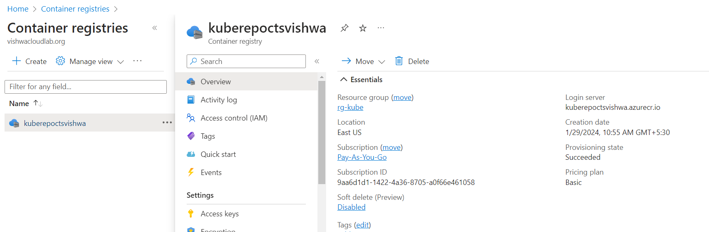
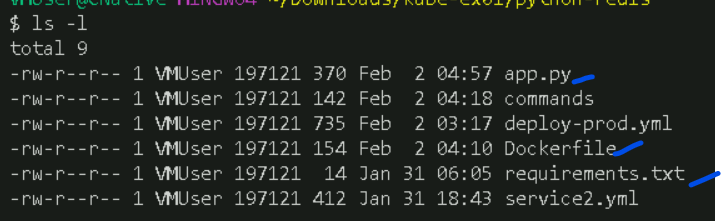
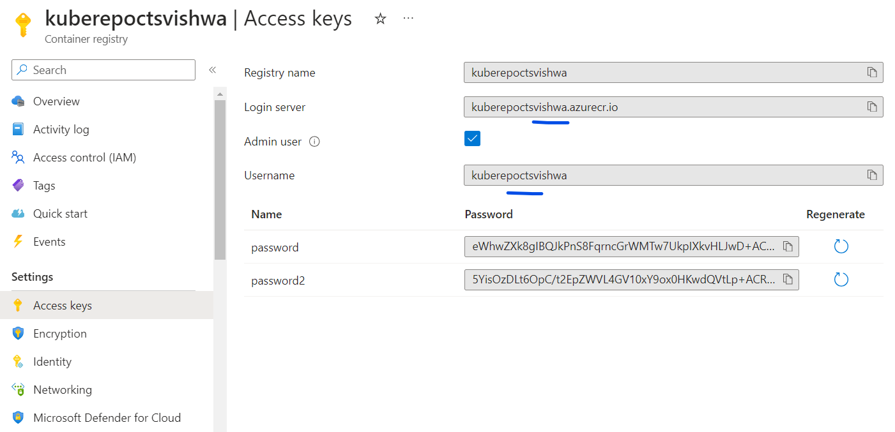

# Simple Application deployment on the AKS.


## Pre-Requisite 
 * Upload the Docker image to the ACR.

   1. Az commands to create the ACR. 
   ```
   az group create --name rg-kube --location "East US"
   az acr create --resource-group rg-kube --name kuberepoctsvishwa --sku Basic
   ```
   

   2. Download the repo to the local and build the image locally first for app.
   
   ```
   docker build . -t kuberepoctsvishwa.azurecr.io/kuberepoctsvishwa:v1
   ```

   3. Login to the repo and push the image.
   
   ```
   docker login kuberepoctsvishwa.azurecr.io -u kuberepoctsvishwa 
   ```
   after this pass the password.

   4. 
 * Kubernetes cluster on Azure


## Steps to deploy 